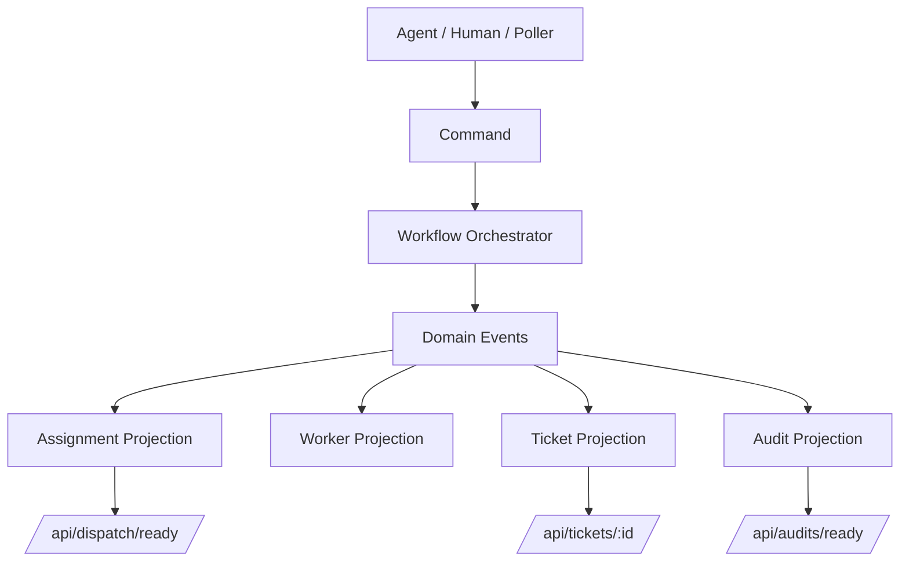

# 工单平台事件清单与 Command Contract v1

**日期**：2026-03-13  
**状态**：📝 设计稿 / 可指导第一阶段开发  
**标签**：#工单平台 #事件驱动 #发布订阅 #Command #Event #Contract #OpenClaw

> 这篇文档是《[[2026-03-13-工单平台发布订阅事件驱动重构设计]]》的落地补充稿。  
> 上一篇解决“为什么这么改、总体怎么拆”；这一篇解决“代码应该按什么 contract 开始改”。

---

## 一句话结论

要把工单平台改成 **事件驱动 + Pub/Sub + 单写者状态机**，至少要先把下面三件事固定下来：

1. **Command 是什么**：谁能发、输入是什么、guard 是什么、失败码是什么；
2. **Event 是什么**：平台认定“已经发生”的事实长什么样；
3. **因果/幂等/版本规则是什么**：避免再次出现 comment、dispatch_state、status、available_actions 四层打架。

这篇文档的目标就是把这三件事落到可以指导第一阶段开发的粒度。

---

## 适用范围

本稿主要覆盖：

- ticket 生命周期核心命令
- assignment / dispatch / receipt 生命周期
- worker 生命周期事件
- audit signal 生命周期
- event envelope / command envelope 标准格式
- 第一阶段必须统一的错误码与 guard contract

本稿**暂不覆盖**：

- 完整前端 UI 改造细节
- 跨 Gateway transport 细节展开
- analytics / BI 侧长尾 projection
- 所有历史 API 的完整兼容矩阵（另文处理）

---

## 基础原则

## 1. Single Writer

只有 **Workflow Orchestrator** 可以修改：

- `ticket.status`
- `current_actor`
- `next_actor`
- `review_state`
- `locked_by / locked_at`
- `pause_reason / decision_summary`
- 以及所有与 ticket 主状态机相关的字段

其他模块只能：
- 发 command
- 发布 event
- 更新 projection

不能直接改主 ticket aggregate。

## 2. Command 和 Event 严格分离

- Command：意图（someone wants something）
- Event：事实（something has happened）

### 示例
- `QueueTicket`：想把 ticket 放行到 queued
- `TicketQueued`：ticket 已经被平台正式推进到 queued

## 3. Projection 不是主真相源

- `/api/dispatch/ready`
- `/api/notifications/ready`
- `/api/audits/ready`
- TicketDetail / Workboard

都应从事件流投影，不应反向成为状态机真相源。

## 4. comment 只能是留痕，不是核心驱动事实

comment 可以保留，但不再被视作：
- worker 真值
- 派单真值
- 责任交接真值
- bridge 是否成功的主依据

---

# 一、Aggregate 与 Ownership

建议先固定 3 个核心 aggregate。

## 1. Ticket Aggregate

### 主键
- `ticket_id`

### 负责字段
- `status`
- `current_actor`
- `next_actor`
- `assigned_agent`
- `triage_owner`
- `review_owner`
- `decision_owner`
- `review_state`
- `locked_by / locked_at`
- `paused_*`
- `result_summary / error / decision_summary`

### Owner
- Workflow Orchestrator

---

## 2. Assignment Aggregate

### 主键
- `assignment_id`

### 负责字段
- `ticket_id`
- `stage`
- `agent_id`
- `target_session_key`
- `delivery_intent`
- `assignment_status`
- `dispatch_event_id`
- `delivery timestamps`
- `receipt state`

### Owner
- Assignment Planner + Delivery / Receipt 子系统

> 注意：Assignment Aggregate 可以独立变化，但不能直接改 ticket 主状态。

---

## 3. Worker Aggregate

### 主键
- `worker_key`

### 负责字段
- `ticket_id`
- `session_key`
- `run_id`
- `status`
- `started_at`
- `last_heartbeat_at`
- `finished_at`
- `failure_kind`
- `failure_detail`
- `replacement_for`

### Owner
- Worker Registry

> Worker 只表达执行事实，不表达 ticket 流程最终状态。

---

# 二、Envelope Contract

## 1. Event Envelope

所有事件建议统一格式：

```json
{
  "event_id": "evt_20260313_000001",
  "event_type": "ticket.queued",
  "aggregate_type": "ticket",
  "aggregate_id": 131,
  "aggregate_version": 12,
  "occurred_at": "2026-03-13T13:07:00.000Z",
  "producer": "workflow-orchestrator",
  "correlation_id": "asg_20260313111134_131_beavy_9ftg",
  "causation_id": "cmd_20260313_000122",
  "idempotency_key": "ticket-131-queue-v1",
  "payload": {}
}
```

## 必填字段
- `event_id`
- `event_type`
- `aggregate_type`
- `aggregate_id`
- `aggregate_version`
- `occurred_at`
- `producer`
- `correlation_id`
- `causation_id`
- `idempotency_key`
- `payload`

## 字段说明

### `aggregate_version`
- 同一 aggregate 每次状态变更递增
- 用于防止并发写乱序

### `correlation_id`
- 同一次业务链路共用
- 例如同一个 assignment / 同一个 reviewer 提审链路

### `causation_id`
- 表明这条 event 由哪个 command / 上游 event 导致
- 用于排障时恢复因果树

### `idempotency_key`
- 用于避免重复消费 / 重复写入
- 同一业务动作重试时必须稳定

---

## 2. Command Envelope

所有命令建议统一格式：

```json
{
  "command_id": "cmd_20260313_000122",
  "command_type": "QueueTicket",
  "aggregate_type": "ticket",
  "aggregate_id": 131,
  "issued_at": "2026-03-13T13:06:58.000Z",
  "issuer": {
    "kind": "agent",
    "id": "leoss"
  },
  "correlation_id": "asg_20260313111134_131_beavy_9ftg",
  "idempotency_key": "ticket-131-queue-v1",
  "payload": {}
}
```

## 必填字段
- `command_id`
- `command_type`
- `aggregate_type`
- `aggregate_id`
- `issued_at`
- `issuer`
- `correlation_id`
- `idempotency_key`
- `payload`

---

# 三、Command Contract（核心命令清单）

下面先列第一阶段必须固定的命令。

---

## A. Ticket Lifecycle Commands

## 1. `QueueTicket`

### 作用
把工单从 `triage` 放行到 `queued`。

### 典型来源
- triage owner 的人工操作
- `triage_structured_report` 被 interpreter 转换后的 command

### payload
```json
{
  "reason": "triage complete",
  "route": {
    "assigned_agent": "beavy",
    "review_owner": "leoss"
  }
}
```

### guard
- 当前 `ticket.status == triage`
- 责任链完整
- 不允许缺少 `assigned_agent / review_owner`

### 成功事件
- `ticket.queued`
- `assignment.created`
- `assignment.delivery_requested`

### 失败码
- `TRIAGE_QUEUE_CHAIN_INCOMPLETE`
- `INVALID_STATUS_TRANSITION`
- `COMMAND_IDEMPOTENCY_CONFLICT`

---

## 2. `StartWork`

### 作用
把工单从 `queued` 推到 `running`。

### 注意
这是平台侧桥接动作，不允许 agent 自己直接写 ticket 状态。

### 触发来源
- `assignment.receipt_accepted` 后，由 Orchestrator 决定是否执行
- 人工管理面重试

### payload
```json
{
  "actor": "beavy",
  "assignment_id": "asg_xxx",
  "worker_evidence": {
    "worker_key": "cursor-ticket-131"
  }
}
```

### guard
- 当前 `status == queued`
- 当前 actor 与责任链一致
- 不存在更高优先级 running conflict
- execution_mode 需要 worker 时，worker 证据必须满足 contract
- 不允许 stale reservation 误占 running capacity

### 成功事件
- `ticket.started`

### 失败码
- `RUNNING_TICKET_CONFLICT`
- `EXECUTION_WORKER_REQUIRED`
- `INVALID_ASSIGNMENT_STATE`
- `INVALID_STATUS_TRANSITION`

---

## 3. `SubmitForReview`

### 作用
把工单从 `running` 推到 `done`。

### 触发来源
- `execution_completed`
- `review_submission`
- executor 主动提交验收

### payload
```json
{
  "actor": "beavy",
  "result_summary": "implemented and smoke passed",
  "artifacts": ["commit:abc123", "task:bt-20260313-001"]
}
```

### guard
- 当前 `status == running`
- actor 必须为当前执行责任人
- 必要时检查 worker 已进入 terminal or sealed 状态

### 成功事件
- `ticket.submitted_for_review`
- `assignment.created`（给 reviewer）
- `assignment.delivery_requested`（reviewer handoff）

### 失败码
- `INVALID_STATUS_TRANSITION`
- `ROLE_ACTOR_MISMATCH`
- `ACTIVE_WORKER_NOT_SEALED`

---

## 4. `StartReview`

### 作用
确认 reviewer 已正式接单，但不自动 complete。

### 触发来源
- `assignment.receipt_accepted(stage=review)`

### guard
- 当前 `status == done` 或 `review`
- actor 必须是 `review_owner`

### 成功事件
- `ticket.review_started`

### 说明
建议最终 ticket 外显状态仍为 `review`，但内部事件要显式存在，避免 reviewer 主交接继续靠 comment 解释。

### 失败码
- `ROLE_ACTOR_MISMATCH`
- `INVALID_STATUS_TRANSITION`

---

## 5. `ApproveReview`

### 作用
把工单从 `review` 推到 `complete`。

### payload
```json
{
  "actor": "leoss",
  "approval_summary": "accepted"
}
```

### guard
- 当前 `status == review`
- actor 必须是 `review_owner`

### 成功事件
- `ticket.completed`

### 失败码
- `ROLE_ACTOR_MISMATCH`
- `INVALID_STATUS_TRANSITION`

---

## 6. `RejectReview`

### 作用
把工单从 `review` 打回 `queued`。

### payload
```json
{
  "actor": "leoss",
  "reason": "missing live smoke"
}
```

### guard
- 当前 `status == review`
- actor 必须是 `review_owner`

### 成功事件
- `ticket.rejected_to_queue`
- `assignment.created`
- `assignment.delivery_requested`

### 失败码
- `ROLE_ACTOR_MISMATCH`
- `INVALID_STATUS_TRANSITION`

---

## 7. `PauseTicket`

### 作用
任意允许阶段转 `paused`。

### guard
- 当前状态允许 pause
- actor 必须符合 `current_actor` / reviewer / 管理面规则

### 成功事件
- `ticket.paused`

### 失败码
- `INVALID_STATUS_TRANSITION`
- `ROLE_ACTOR_MISMATCH`

---

## 8. `RequestDecision`

### 作用
从 `running` / `review` 把票推进到 `pending_decision`。

### payload
```json
{
  "actor": "beavy",
  "decision_summary": "need owner decision",
  "decision_context": {
    "question": "是否继续按方案 B",
    "options": ["继续", "暂停"]
  }
}
```

### guard
- 当前 `status in [running, review]`
- 当前 actor 有权提出决策请求

### 成功事件
- `ticket.pending_decision`
- `boss.notification_requested`

### 失败码
- `INVALID_STATUS_TRANSITION`
- `ROLE_ACTOR_MISMATCH`

---

## 9. `BlockTicket`

### 作用
把 `running` 工单切到 `blocked`。

### guard
- 当前 `status == running`
- 必须提供 blocker summary

### 成功事件
- `ticket.blocked`

### 失败码
- `INVALID_STATUS_TRANSITION`
- `MISSING_REQUIRED_FIELD`

---

## 10. `FailTicket`

### 作用
把 `running` 工单切到 `failed`。

### guard
- 当前 `status == running`
- 必须提供 error / failure evidence

### 成功事件
- `ticket.failed`

### 失败码
- `INVALID_STATUS_TRANSITION`
- `MISSING_REQUIRED_FIELD`

---

## 11. `FormalReassignTicket`

### 作用
正式改派执行责任人。

### payload
```json
{
  "actor": "leoss",
  "target_agent": "beavy",
  "reason": "ownership correction"
}
```

### guard
- 当前状态允许 reassign
- actor 必须符合管理面或当前责任人规则

### 成功事件
- `ticket.reassigned`
- `assignment.closed`（旧）
- `assignment.created`（新）
- `assignment.delivery_requested`

### 失败码
- `ROLE_ACTOR_MISMATCH`
- `INVALID_STATUS_TRANSITION`

---

## 12. `HandoffTicket`

### 作用
交接给新执行者，但保留这是一次明确 handoff 事实，而不是普通改派。

### 成功事件
- `ticket.handed_off`

### 与 `FormalReassignTicket` 区别
- `formal_reassign`：管理面纠偏/重新派责
- `handoff`：执行态主动交接

---

## B. Assignment Lifecycle Commands

## 13. `CreateAssignment`

### 作用
为某个 ticket 阶段生成 assignment。

### 一般来源
- Assignment Planner 在消费 `ticket.domain.*` 后内部触发

### 成功事件
- `assignment.created`

---

## 14. `RequestAssignmentDelivery`

### 作用
请求投递 assignment 到目标 session。

### 成功事件
- `assignment.delivery_requested`

---

## 15. `AckAssignmentDelivery`

### 作用
transport 已送达，进入等待 receipt。

### 成功事件
- `assignment.delivered`

### 失败码
- `ASSIGNMENT_NOT_FOUND`
- `DELIVERY_STATE_CONFLICT`

---

## 16. `RecordAssignmentReceipt`

### 作用
记录 agent 的 `dispatch_receipt`。

### payload
```json
{
  "assignment_id": "asg_xxx",
  "dispatch_id": 1234,
  "decision": "accepted",
  "stage": "queued",
  "agent": "beavy",
  "message": "accepted"
}
```

### guard
- assignment 必须存在
- receipt 对应的 stage 必须与 assignment 当前 stage 一致
- 已关闭 / 已失效 assignment 不接受旧 receipt 覆盖

### 成功事件
- `assignment.receipt_accepted`
- 或 `assignment.receipt_declined`

### 失败码
- `ASSIGNMENT_NOT_FOUND`
- `ASSIGNMENT_STAGE_MISMATCH`
- `STALE_RECEIPT_IGNORED`
- `COMMAND_IDEMPOTENCY_CONFLICT`

---

## C. Worker Lifecycle Commands

## 17. `RegisterWorkerStarted`

### 作用
登记 worker 已启动。

### 成功事件
- `worker.started`

---

## 18. `RecordWorkerHeartbeat`

### 作用
记录 worker heartbeat。

### 成功事件
- `worker.heartbeat`

---

## 19. `RegisterWorkerFinished`

### 作用
记录 worker 正常结束。

### 成功事件
- `worker.finished`

---

## 20. `RegisterWorkerFailed`

### 作用
记录 worker 失败。

### payload
```json
{
  "worker_key": "subagent:xxx",
  "failure_kind": "environment_dependency",
  "failure_detail": "ModuleNotFoundError: scipy"
}
```

### 成功事件
- `worker.failed`

---

## 21. `RegisterWorkerReplacement`

### 作用
记录 replacement worker 接管旧 worker。

### 成功事件
- `worker.replaced`

---

# 四、Event Catalog（第一阶段必须有的事件）

下面按类别列最关键的事件。

---

## A. Ticket Domain Events

## 1. `ticket.created`

### payload
```json
{
  "status": "triage",
  "triage_owner": "leoss",
  "assigned_agent": "beavy",
  "review_owner": "leoss"
}
```

---

## 2. `ticket.queued`

### payload
```json
{
  "from_status": "triage",
  "to_status": "queued",
  "current_actor": "beavy",
  "route": {
    "assigned_agent": "beavy",
    "review_owner": "leoss"
  }
}
```

---

## 3. `ticket.started`

### payload
```json
{
  "from_status": "queued",
  "to_status": "running",
  "current_actor": "beavy",
  "assignment_id": "asg_xxx"
}
```

---

## 4. `ticket.submitted_for_review`

### payload
```json
{
  "from_status": "running",
  "to_status": "done",
  "result_summary": "done",
  "submitted_by": "beavy"
}
```

---

## 5. `ticket.review_started`

### payload
```json
{
  "from_status": "done",
  "to_status": "review",
  "review_owner": "leoss",
  "assignment_id": "asg_review_xxx"
}
```

---

## 6. `ticket.completed`

### payload
```json
{
  "from_status": "review",
  "to_status": "complete",
  "approved_by": "leoss"
}
```

---

## 7. `ticket.paused`
## 8. `ticket.blocked`
## 9. `ticket.failed`
## 10. `ticket.pending_decision`
## 11. `ticket.reassigned`
## 12. `ticket.handed_off`

这些 payload 都应至少包含：
- `from_status`
- `to_status`
- `actor`
- `reason/summary`
- 必要时的 route / ownership 变化

---

## B. Assignment Lifecycle Events

## 13. `assignment.created`

### payload
```json
{
  "assignment_id": "asg_xxx",
  "ticket_id": 131,
  "stage": "queued",
  "agent_id": "beavy",
  "target_session_key": "agent:beavy:ticket:131",
  "intent": "dispatch"
}
```

---

## 14. `assignment.delivery_requested`

### payload
```json
{
  "assignment_id": "asg_xxx",
  "dispatch_id": 2001,
  "target_gateway_id": "mac-main",
  "transport": "session_send"
}
```

---

## 15. `assignment.delivered`

### payload
```json
{
  "assignment_id": "asg_xxx",
  "dispatch_id": 2001,
  "delivery_state": "delivered",
  "awaiting_receipt_from": "beavy",
  "ack_deadline_at": "2026-03-13T13:20:00.000Z"
}
```

---

## 16. `assignment.receipt_accepted`

### payload
```json
{
  "assignment_id": "asg_xxx",
  "dispatch_id": 2001,
  "agent": "beavy",
  "stage": "queued",
  "decision": "accepted"
}
```

---

## 17. `assignment.receipt_declined`
## 18. `assignment.receipt_overdue`
## 19. `assignment.closed`
## 20. `assignment.refreshed`

---

## C. Worker Lifecycle Events

## 21. `worker.started`
## 22. `worker.heartbeat`
## 23. `worker.finished`
## 24. `worker.failed`
## 25. `worker.replaced`

这些 payload 至少应有：
- `worker_key`
- `ticket_id`
- `status`
- `session_key`
- `run_id`
- `replacement_for`（如适用）
- `failure_kind / failure_detail`（如适用）

---

## D. Audit Signal Events

## 26. `audit.stale_running_detected`
## 27. `audit.stale_review_detected`
## 28. `audit.workflow_mismatch_detected`
## 29. `audit.routing_gap_detected`
## 30. `audit.delivery_gap_detected`

### payload 统一建议
```json
{
  "ticket_id": 130,
  "audit_type": "stale_running",
  "suggested_status": "running",
  "suggested_actor": "cowder",
  "reason": "latest effective worker is stale",
  "confidence": "medium"
}
```

> 注意：这是 signal，不是最终状态裁决。

---

# 五、错误码与 Guard Contract

第一阶段建议固定下面这些错误码，避免不同模块自行发明口径。

## Ticket / Workflow Errors
- `INVALID_STATUS_TRANSITION`
- `ROLE_ACTOR_MISMATCH`
- `TRIAGE_QUEUE_CHAIN_INCOMPLETE`
- `RUNNING_TICKET_CONFLICT`
- `EXECUTION_WORKER_REQUIRED`
- `ACTIVE_WORKER_NOT_SEALED`
- `MISSING_REQUIRED_FIELD`
- `REVIEW_PLAN_CONFLICT`

## Assignment / Dispatch Errors
- `ASSIGNMENT_NOT_FOUND`
- `INVALID_ASSIGNMENT_STATE`
- `ASSIGNMENT_STAGE_MISMATCH`
- `STALE_RECEIPT_IGNORED`
- `DELIVERY_STATE_CONFLICT`
- `DISPATCH_ALREADY_ACKED`
- `DISPATCH_NOT_FOUND`

## Command / Idempotency Errors
- `COMMAND_IDEMPOTENCY_CONFLICT`
- `COMMAND_VERSION_CONFLICT`
- `EVENT_VERSION_GAP`

## Worker Errors
- `WORKER_NOT_FOUND`
- `WORKER_HEARTBEAT_STALE`
- `WORKER_REPLACEMENT_CONFLICT`

---

# 六、状态机与桥接规则（第一阶段必须统一）

## 1. `triage_structured_report`

### 旧问题
以前会把 triage 结论、责任链、queue 动作、comment 写法混在一起。

### 新规则
`triage_structured_report` 只负责：
- 产生一个 `QueueTicket` command（若 verdict=queue）
- 或产生 `RequestDecision` / `PauseTicket` / no-op command

它自己不直接写 ticket 状态。

---

## 2. `dispatch_receipt(stage=queued, decision=accepted)`

### 新规则
不再把这条 report 直接等价成“票已经 running”。

而是：
1. Receipt Processor 发布 `assignment.receipt_accepted`
2. Orchestrator 决定是否发 `StartWork`
3. guard 通过后才生成 `ticket.started`

---

## 3. `execution_completed` / `review_submission`

### 新规则
这两类 report 不能再直接跨层把 comment、bridge、status 一口气写乱。

它们必须被翻译成 command：
- 若当前 `status == running`：`SubmitForReview`
- 若当前 `status == queued`：先由 Orchestrator 决定是否需要 `StartWork` 再 `SubmitForReview`

### 关键点
bridge 顺序必须由 Orchestrator 统一决定，不能分散在 interpreter 或 ready 逻辑里各自猜。

---

# 七、Projection Contract（第一阶段最少要求）

## 1. `dispatch_ready_projection`

应只表达“当前可投递的 assignment”，而不是继续做大量临场业务推理。

### 建议字段
- `dispatch_id`
- `assignment_id`
- `ticket_id`
- `stage`
- `agent_id`
- `target_session_key`
- `delivery_intent`
- `reason`
- `dedupe_key`
- `escalation_tier`
- `created_at`

### 不该承担的职责
- 复杂 bridge 推理
- 评论语义解释
- worker 真值推断
- 审计主裁决

---

## 2. `notification_ready_projection`

用于：
- pending_decision
- complete
- failed
- boss-facing 路由

---

## 3. `audit_ready_projection`

用于：
- stale_running
- stale_review
- workflow_mismatch
- routing_gap

### 关键点
这是 signal projection，不直接改 workflow。

---

## 4. `ticket_projection`

必须统一外显：
- `ticket.status`
- `current_actor`
- `next_actor`
- `dispatch_state`
- `available_actions`
- `worker_stats`
- `latest_effective_worker`

### 重点
`dispatch_state` 必须来源于 assignment/dispatch 事件投影；  
`worker_stats` 必须来源于 worker 事件投影；  
不能再主要依靠 comment 推断。

---

# 八、Mermaid 图：Command → Event → Projection



---

# 九、第一阶段开发最少落地清单

如果按本文直接开第一阶段开发，我建议最低交付是：

## 1. 新增数据结构
- `domain_events`
- `commands`
- `event_subscriptions`
- `dispatch_ready_projection`
- `ticket_projection`
- `worker_projection`

## 2. 改造模块
- `api/report-interpreter.js`
  - 从“直接混合解释+推进”改成“翻译成 command / event”
- `api/state-machine.js`
  - 抽成 Orchestrator 内核
- `api/dispatch.js`
  - 收缩成 assignment lifecycle 子系统
- `api/store-sqlite.js`
  - 补 event/command/projection 存储
- `api/app.js`
  - ready API 改读 projection

## 3. 先保兼容，不立刻推翻所有旧接口
- 旧 `/api/dispatch/ready` 暂保留
- 旧 report API 暂保留
- 但内部开始双写 event log + projection

---

# 十、验收基线（第一阶段）

第一阶段至少要通过这些 smoke：

1. `triage_structured_report -> QueueTicket -> ticket.queued`
2. `dispatch_receipt(stage=queued, accepted) -> StartWork -> ticket.started`
3. `execution_completed -> SubmitForReview -> ticket.submitted_for_review`
4. `review receipt accepted -> ticket.review_started`
5. `approve -> ticket.completed`
6. replacement worker 启动后，旧 failed comment 不再污染 running 判断
7. `dispatch_state / ticket.status / available_actions / worker_stats` 同源一致
8. `workflow_mismatch` 只进 audit signal，不直接污染主状态机

---

# 十一、现在这篇文档够干什么

这篇文档现在的定位是：

## 已经够
- 开第一阶段重构任务
- 写骨架代码
- 对齐 command/event schema
- 约束错误码与幂等规则
- 给 reviewer 一致口径

## 还没完全覆盖
- 所有历史 API 兼容迁移时序
- 每个 projection 的完整 SQL 设计
- 全部 transport/gateway 细节
- 前端页面字段逐项迁移说明

这些可以在后续“迁移实施方案 v1”里补。

---

# 十二、建议的下一篇文档

如果继续往下走，建议下一篇直接写：

## 《工单平台事件驱动迁移实施方案 v1》

重点补：
- 哪些文件先改
- 如何双写 event + projection
- 如何兼容旧 `/api/dispatch/ready`
- smoke / rollback / cutover 策略

---

## 附：一句话判断

如果上一篇解决的是“方向对不对”，那这篇解决的是：

> **第一阶段代码应该按什么 command/event/guard/error contract 开始改。**

它还不是最终实现说明书，但已经足够把“别再靠 ready 现场硬猜”这件事正式改成**可开发的 contract**。