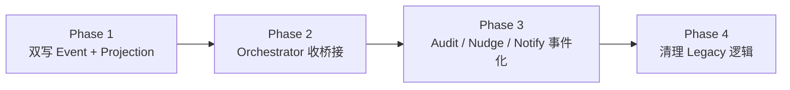
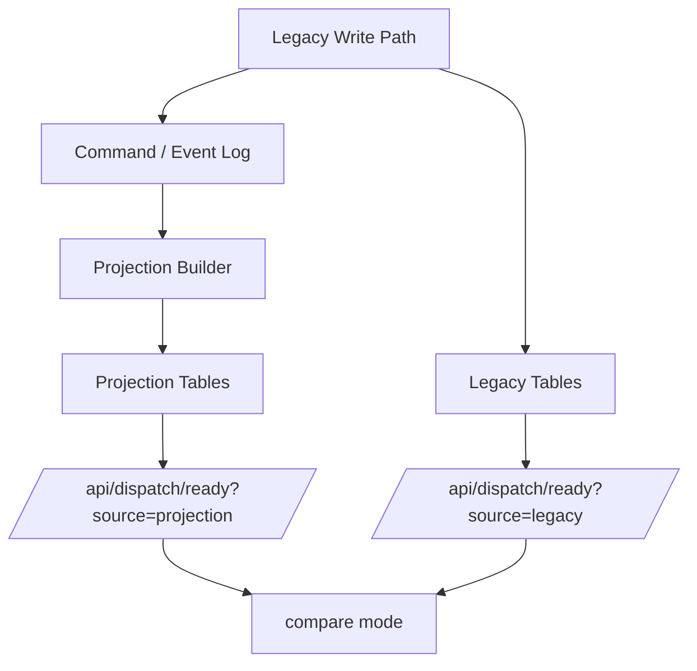

# 工单平台事件驱动迁移实施方案 v1

**日期**：2026-03-13  
**状态**：📝 迁移实施稿 / 可用于第一阶段排期  
**标签**：#工单平台 #迁移方案 #事件驱动 #发布订阅 #实施方案 #OpenClaw

> 本文承接：
> - [[2026-03-13-工单平台发布订阅事件驱动重构设计]]
> - [[2026-03-13-工单平台事件清单与Command Contract v1]]
>
> 前两篇解决“为什么改、按什么 contract 改”；这一篇解决“按什么顺序改、怎么兼容上线、怎么回滚”。

---

## 一句话结论

迁移不应该一次性推翻现有平台，而应该采用：

> **事件日志与 projection 先双写 → ready API 先改读 projection → 再逐步把状态推进收回 Orchestrator。**

也就是：
- **Phase 1**：不破外部 contract，先补事件层与读模型层；
- **Phase 2**：把状态机桥接统一收到 Orchestrator；
- **Phase 3**：把审计 / 催办 / boss notify 完整事件化，并清掉旧 ready 现场推理遗留逻辑。

---

## 迁移目标

本次迁移的直接目标，不是“变成一个理论上更优雅的系统”，而是解决当前 live 暴露出来的几类现实问题：

1. **`dispatch / notify / audit / nudge` 语义混杂**
2. **`ticket.status / dispatch_state / available_actions / comments` 四层容易分叉**
3. **queued 主票 bridge 逻辑散落，导致 `#131` 类问题难以稳定收口**
4. **worker replacement / stale comment 混杂，导致 `#130` 类现场持续噪音**
5. **`/api/dispatch/ready` 承担过多业务推理，维护成本越来越高**

---

## 非目标（第一阶段明确不做）

为了避免范围失控，第一阶段不做以下事情：

1. 不引入 Kafka / NATS / Redis Stream 等外部重型消息中间件
2. 不重写全部前端页面
3. 不同时改完所有 agent-facing API
4. 不一次性移除所有旧 comment / report 写法
5. 不在第一阶段里把所有历史状态都强行补 replay

第一阶段优先使用：
- **SQLite / 现有 DB 内 event log + outbox + projection**
- **旧 API 保留，内部双写**
- **最小兼容迁移**

---

# 一、总体迁移策略

## 策略原则

### 原则 1：先双写，不先硬切

第一阶段不要直接把现有：
- `dispatch.js`
- `report-interpreter.js`
- `app.js -> /dispatch/ready`

全部推倒重来。

正确顺序是：
1. 保持现有主流程仍可工作；
2. 新增 event log / projection；
3. 在现有写路径中同步双写 event；
4. 等 projection 稳定后，再让 ready/read API 改读 projection。

### 原则 2：先收读模型，再收写模型

先把：
- `dispatch_ready_projection`
- `ticket_projection`
- `worker_projection`

做出来，能把 live 真值投影稳定后，再逐步把 bridge 逻辑收回 Orchestrator。

### 原则 3：审计最后切，不抢在前面

`audit / workflow_mismatch / nudge` 现在最容易看起来“逻辑明显有问题”，但其实它依赖的底层真值最混乱。

所以顺序不能是：
- 先重写审计

而应该是：
- 先把 ticket / assignment / worker 真值收稳
- 再改 audit signal / nudge

---

# 二、阶段划分

建议拆成 **3 个阶段 + 1 个收尾阶段**。

---

## Phase 1：事件日志与 Projection 骨架落地（低风险双写）

### 目标
在**不破现有外部接口**的前提下，先让系统具备：
- event log
- command log
- projection
- worker 独立真值视图

### 完成标准
- 现有 API 仍可用
- 内部新增双写 event log
- `/api/tickets/:id` 能从 projection 读取部分关键字段（或比对验证）
- `/api/dispatch/ready` 已具备 projection 数据源雏形

### 本阶段重点收益
- 先让“系统能记录清楚发生过什么”
- 给后续 orchestrator 收写模型铺路

---

## Phase 2：Workflow Orchestrator 收拢桥接逻辑（中风险）

### 目标
把当前分散在：
- `report-interpreter.js`
- `state-machine.js`
- `app.js`
- `dispatch ready 逻辑`

里的关键 bridge 收回 Orchestrator。

### 优先收的桥接
1. `triage -> queued`
2. `queued -> running`
3. `running -> done`
4. `done -> review`
5. `review -> complete`

### 完成标准
- `execution_completed / review_submission` 不再直接到处混合写状态
- bridge 顺序统一由 Orchestrator 决定
- `#131` 这类 queued 主票桥接问题能靠单一写模型稳定收口

---

## Phase 3：审计/催办/通知事件化（中风险）

### 目标
让 Sheeply / 审计层彻底退成 signal producer。

### 本阶段拆分
- `audit.signal.*`
- `nudge.requested`
- `boss.notification_requested`
- `review reminder / delivery gap` 等都改成订阅式处理

### 完成标准
- `/api/audits/ready` 成为标准 projection
- `workflow_mismatch` 不再混在普通派单 ready 中做主裁决
- `dispatch / audit / nudge / notify` 四种语义明确分层

---

## Phase 4：清理与收尾（低风险）

### 目标
- 删除旧 ready 现场硬推理逻辑
- 删除遗留双写临时代码
- 固化文档、测试、live acceptance

### 完成标准
- 旧逻辑只剩兼容 shim 或彻底移除
- 所有稳定读口都来自 projection
- reviewer 口径统一

---

# 三、数据层改造计划

## 1. 新增表

第一阶段建议最少新增以下表：

### `domain_events`
用于记录所有事件流。

建议字段：
- `id`
- `event_id`
- `event_type`
- `aggregate_type`
- `aggregate_id`
- `aggregate_version`
- `producer`
- `correlation_id`
- `causation_id`
- `idempotency_key`
- `payload_json`
- `occurred_at`
- `created_at`

### `commands`
用于记录 command 请求与执行结果。

建议字段：
- `id`
- `command_id`
- `command_type`
- `aggregate_type`
- `aggregate_id`
- `issuer_kind`
- `issuer_id`
- `correlation_id`
- `idempotency_key`
- `payload_json`
- `result_status`
- `result_error_code`
- `result_error_message`
- `created_at`
- `finished_at`

### `event_subscriptions`
记录 projection/subscriber 消费进度。

建议字段：
- `subscriber_name`
- `last_event_id`
- `last_sequence`
- `updated_at`

### `dispatch_ready_projection`
### `notification_ready_projection`
### `audit_ready_projection`
### `ticket_projection`
### `worker_projection`

这些 projection 表可以逐步加，不必第一天全做完，但至少应先落：
- `ticket_projection`
- `worker_projection`
- `dispatch_ready_projection`

---

## 2. 老表继续保留

以下老表第一阶段不要删：
- `tickets`
- `ticket_assignments`
- `dispatch_events`
- `notification_events`
- `delivery_attempts`
- `audit_results`
- `execution_workers`

### 原因
它们仍是 live 运行态的关键兼容层。

### 但要新增规则
- 这些表中的关键变更，要同步产出 event
- 不允许再只改老表、不产事件

---

# 四、文件级改造顺序

下面给一个能直接指导开发顺序的文件清单。

---

## 第一批：先加底座，不破现有行为

### 1. `api/store-sqlite.js`

### 要做什么
- 增加 `domain_events` / `commands` / `event_subscriptions` / projection 表的 schema
- 增加：
  - `appendDomainEvent()`
  - `appendCommandLog()`
  - `getAggregateVersion()`
  - `upsertProjection()`

### 目标
先把事件落库能力补齐。

---

### 2. `api/dispatch.js`

### 要做什么
- 保留现有 dispatch_events 逻辑
- 但同时在关键节点产出 event：
  - `assignment.delivery_requested`
  - `assignment.delivered`
  - `assignment.receipt_accepted`
  - `assignment.receipt_overdue`

### 目标
让 dispatch 生命周期开始进入事件流。

---

### 3. `api/store.js`

### 要做什么
- 在 ticket 更新 / assignment 更新 / worker 更新时加 event append hook
- 但第一阶段先尽量少改主业务语义

---

## 第二批：收读模型

### 4. `api/app.js`

### 要做什么
- 新增 projection builder / refresh 逻辑
- 逐步把：
  - `/api/tickets/:id`
  - `/api/dispatch/ready`
  - `/api/notifications/ready`
  改为优先读 projection

### 目标
让 ready API 从现场推理器，退化成 projection reader。

---

### 5. `api/report-interpreter.js`

### 要做什么
- 先不一次性推翻
- 第一阶段先把 report -> event / command 的 translation 层插进去
- 保留旧行为兼容，但开始双写：
  - `triage_structured_report -> QueueTicket command`
  - `dispatch_receipt -> RecordAssignmentReceipt command`
  - `execution_completed / review_submission -> SubmitForReview command or staged command`

### 目标
为第二阶段收 Orchestrator 做铺垫。

---

## 第三批：收写模型

### 6. `api/state-machine.js`

### 要做什么
- 逐步把它提升成 Workflow Orchestrator 内核
- 把 bridge 顺序决策集中起来
- 明确 command handler：
  - `handleQueueTicket`
  - `handleStartWork`
  - `handleSubmitForReview`
  - `handleApproveReview`
  - ...

### 目标
把真正状态写入统一回到一处。

---

### 7. `api/server.js`

### 要做什么
- 注册 projection refresh / background subscribers
- 保留现有 poller，但逐步改成：
  - 从 projection 拉 ready
  - 不再自己做过多业务判断

---

## 第四批：审计与催办层

### 8. `api/app.js` 中审计相关逻辑
### 9. `auditor / Sheeply` 对接路径

### 要做什么
- 让审计只产生 `audit.signal.*`
- `nudge` / `boss notify` 单独做 subscriber
- 去掉 audit 直接污染 workflow 判断的旧路径

---

# 五、接口兼容策略

## 兼容原则
第一阶段不直接废弃旧接口。

---

## 1. `/api/dispatch/ready`

### 第一阶段
- 外部路径不变
- 内部开始双轨：
  - 旧逻辑生成 ready
  - 新 projection 也生成 ready
- 增加 debug / compare mode

### 对比建议
可以临时加：
- `?source=legacy`
- `?source=projection`
- `?source=compare`

这样方便 live 比对。

---

## 2. `/api/tickets/:id`

### 第一阶段
- 保留旧返回 shape
- 但：
  - `dispatch_state`
  - `worker_stats`
  - `workflow_mismatch`
  开始逐步从 projection 注入

### 目标
先把最容易打架的字段收口。

---

## 3. report API

### 第一阶段
- `dispatch_receipt`
- `triage_structured_report`
- `execution_completed`
- `review_submission`

都仍然保留旧 endpoint

### 但内部改造为
- 先记录 command / event
- 再让现有兼容逻辑继续走

### 第二阶段目标
最终把“真正状态推进”交给 Orchestrator。

---

# 六、双写 / 双读策略

## 双写
第一阶段所有关键写路径都应：
1. 写现有主表（兼容）
2. 追加 command / event log
3. 更新 projection（同步或异步）

## 双读
第一阶段关键读路径应支持：
- legacy only
- projection only
- compare mode

### compare mode 重点对象
- `/api/dispatch/ready`
- `/api/tickets/:id`

### compare mode 输出
至少要能比对：
- ticket status
- current_actor
- dispatch_state
- available_actions
- worker_stats

---

# 七、上线顺序建议

## 第一步：本地单测先补齐

必须新增/补齐测试：
- event append idempotency
- command log idempotency
- projection rebuild
- receipt accepted / overdue / decline
- worker replacement 覆盖旧 failed
- `queued -> running -> done -> review -> complete` 全链路

---

## 第二步：影子模式（shadow mode）

在 live 8788 上先双写，但不让 projection 真正决定业务结果。

### 目标
- 验证 event log 是否完整
- 验证 projection 是否与 legacy 结果一致
- 不影响当前业务行为

### 建议时长
- 至少跑 1 天
- 覆盖：dispatch / review / pause / pending_decision / worker replacement

---

## 第三步：ready API 切 projection 读

先切：
- `/api/dispatch/ready`

后切：
- `/api/notifications/ready`
- `/api/audits/ready`

### 原因
dispatch 是当前最痛点，但也是最容易看 live 差异的地方。

---

## 第四步：bridge 改由 Orchestrator 主导

这一阶段开始真正收口：
- `triage -> queued`
- `queued -> running`
- `running -> done`
- `done -> review`

这是风险最高的一步，必须在 shadow/compare 证明稳定后再切。

---

# 八、回滚方案

## 1. 数据层回滚

新增表原则上不删。  
回滚时：
- 停止使用新 projection
- 继续走旧逻辑
- event log 保留作诊断材料

## 2. 读路径回滚

如果 projection 出现问题：
- `/api/dispatch/ready` 切回 legacy source
- `/api/tickets/:id` 切回 legacy fields

## 3. 写路径回滚

如果 command/event 双写出现异常：
- 保留主写逻辑
- 暂时关闭 event append hook

## 4. 风险边界

回滚时最重要的是：
- 不能损坏现有 ticket lifecycle
- 不能让 ready 完全空掉
- 不能让 assignment receipt 丢失

---

# 九、Smoke / 验收矩阵

以下是每阶段上线前必须过的 smoke。

## Ticket Lifecycle
- [ ] `triage_structured_report -> QueueTicket -> queued`
- [ ] `dispatch_receipt(stage=queued, accepted) -> StartWork -> running`
- [ ] `execution_completed -> SubmitForReview -> done`
- [ ] `dispatch_receipt(stage=review, accepted) -> review`
- [ ] `approve -> complete`
- [ ] `reject -> queued`
- [ ] `pause -> paused`
- [ ] `request_decision -> pending_decision`

## Assignment Lifecycle
- [ ] `delivery_requested -> delivered -> awaiting_receipt`
- [ ] `receipt_accepted`
- [ ] `receipt_declined`
- [ ] `receipt_overdue -> retry`
- [ ] `assignment_refresh` 正确关闭旧 assignment

## Worker Lifecycle
- [ ] worker started
- [ ] worker heartbeat
- [ ] worker failed
- [ ] replacement worker 覆盖旧 worker
- [ ] stale worker 不再持续压制 dispatch / review

## Audit / Signal
- [ ] `workflow_mismatch` 不再直接污染主状态机
- [ ] stale_running 只作为 signal，不直接写 ticket
- [ ] old comment 不再主导 current truth

## Projection Consistency
- [ ] `ticket.status`
- [ ] `dispatch_state`
- [ ] `available_actions`
- [ ] `worker_stats`
- [ ] `current_actor`
- [ ] `next_actor`

在 legacy / projection compare 下保持一致

---

# 十、当前 live 痛点如何映射到迁移任务

## 痛点 1：`#131` queued 主票 bridge 失败

### 迁移对应任务
- 收 `execution_completed / review_submission` 到 command handler
- `queued -> running -> done` 统一由 Orchestrator 处理
- `pending_running_reservation` / running conflict 改从 assignment + worker projection 判断

### Phase
- 主要落在 Phase 2

---

## 痛点 2：`#130` replacement worker 覆盖旧失败但 audit 仍被旧语义污染

### 迁移对应任务
- worker projection 独立
- audit 只读 latest effective worker
- workflow_mismatch 不再直接从 comment 语义推主状态

### Phase
- Phase 1 先做 worker projection
- Phase 3 收 audit signal

---

## 痛点 3：dispatch/nudge/audit/notif 混在 ready

### 迁移对应任务
- dispatch_ready_projection
- notification_ready_projection
- audit_ready_projection
- 各自解耦

### Phase
- Phase 1 先做 projection 雏形
- Phase 3 完整拆分

---

# 十一、建议的任务拆分（可直接变工单）

下面这组可以直接拆成开发工单。

## P0
1. 新增 `domain_events / commands / event_subscriptions` 表
2. 给现有 ticket / assignment / worker 关键写路径补 event append
3. 新增 `ticket_projection / worker_projection / dispatch_ready_projection`
4. 给 `/api/dispatch/ready` 增加 legacy/projection/compare mode

## P1
5. `report-interpreter` 改成 report -> command/event translation
6. `state-machine` 升级为 Orchestrator 内核
7. 收 `triage -> queued -> running -> done -> review` 主桥接链

## P1
8. 审计层 signal 化：`audit.signal.*`
9. `nudge` / `boss notify` 独立 planner
10. 清理旧 `workflow_mismatch` 混派单逻辑

## P2
11. 删除 legacy ready 现场重推理
12. 文档与 live acceptance 全量收口

---

# 十二、Mermaid 图：迁移阶段图

---

# 十三、Mermaid 图：双写迁移模式

---

# 十四、这篇文档现在够干什么

这篇文档现在已经足够：

- 排第一阶段重构顺序
- 拆工单
- 指导开发按双写 / 双读方式落地
- 指导 reviewer 检查每一阶段应该看什么
- 指导上线时如何做 shadow / compare / rollback

它还不是最终的“实现说明书”，但已经够从“设计讨论”进入“实施排期”。

---

# 十五、一句话结论

当前最稳的迁移路线不是“一把梭重写平台”，而是：

> **先把事件与投影底座补起来，再把 bridge 收回单写者 Orchestrator，最后把 audit/nudge/notify 完全拆层。**

这样才能既不炸 live，又真正解决 `#130 / #131` 暴露出来的结构性问题。