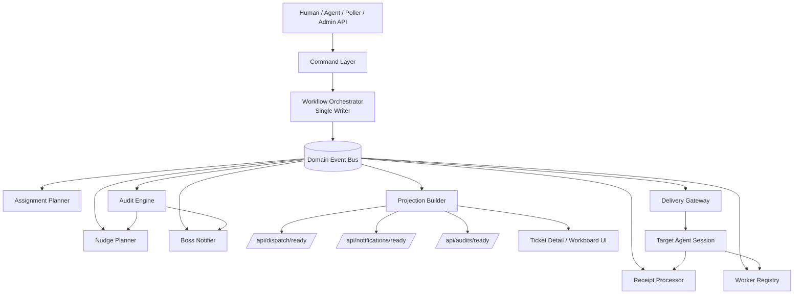
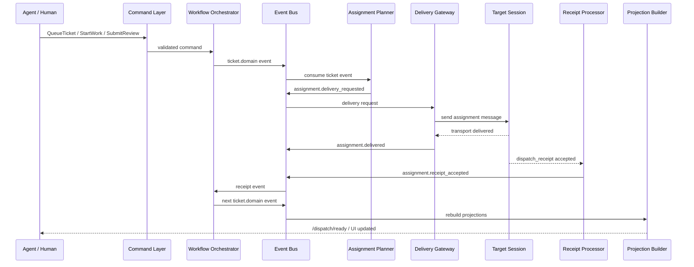
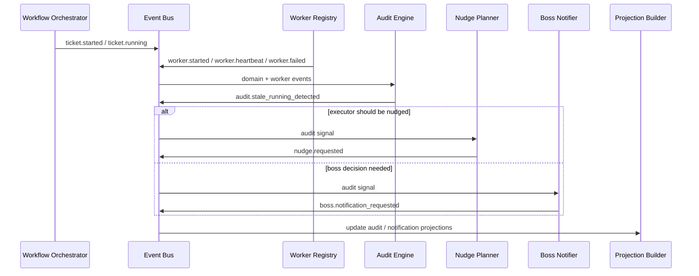

# 工单平台发布订阅（Pub/Sub）事件驱动重构设计

**日期**：2026-03-13  
**状态**：📝 设计稿 / 待评审  
**标签**：#工单平台 #架构 #发布订阅 #事件驱动 #OpenClaw #TicketPlatform

## 一句话结论

当前工单平台的主要问题，不是单纯缺少 ready 队列，而是把 **状态流转、派单、回执、催办、审计、通知、重试** 过度揉在同一层逻辑里，导致 `dispatch / audit / workflow_mismatch / comment 语义 / worker 现场` 经常互相污染。

下一阶段建议改成：

> **Command → Workflow Orchestrator（单写者） → Domain Events → Subscribers → Read Models**

也就是：
- **平台仍保持 single writer**，只有 Orchestrator 能改 ticket 状态；
- 外部模块只发布事实事件或提交命令；
- `dispatch/ready`、`notifications/ready`、`audits/ready` 都退化为**投影视图**，不再承担过多业务真相推导。

---

## 为什么当前框架设计不好

### 1. `dispatch` 承载了太多不同语义

现在至少混了以下几类完全不同的行为：

- 正常执行派单
- reviewer 主交接
- `workflow_mismatch` 异常告警
- stale running / stale review 催办
- boss-facing 的决策通知边界

这些都长得像“发一条消息”，但业务含义完全不同。

结果就是：
- `kind = workflow_mismatch / nudge / normal` 只能作为补丁式区分；
- 路由、去重、重试、receipt 语义很容易打架；
- 一旦票面现场复杂，就会出现 ready 层逻辑膨胀。

### 2. “派单成功”不是一个单一事实

当前至少存在四层不同事实：

1. 平台决定要投递
2. transport 送达成功
3. 目标 session receipt accepted
4. workflow 真正推进到下一阶段

如果这四层事实不拆开建模，就会不断出现：
- 看起来发出去了，但责任没有真正交接；
- ticket 仍旧卡在旧状态；
- `dispatch_state` 与 `ticket.status` 不一致；
- comment 已写“完成/提审”，但状态还 stuck。

### 3. comment 正在承担半结构化状态源角色

comment 本来应该只是留痕，但现在实际被用来参与解释：
- 是否 blocked
- 是否 waiting decision
- 是否 stale
- 是否还适合继续 running

这会导致旧 comment 污染当前 live 真值。

### 4. worker 事实与流程事实没有彻底分层

像 `#130` 这类现场暴露得很明显：
- 首轮 worker 失败；
- replacement worker 又起来了；
- 但旧 comment / audit 仍在反复污染 running 的流程解释。

如果 worker 生命周期不是独立的结构化事实流，平台很难在复杂现场保持稳定解释。

---

## 设计目标

本次重构目标不是“引入消息队列”本身，而是要解决以下问题：

1. **保持单写者原则**
   - 只有 Workflow Orchestrator 可以修改 ticket 状态。

2. **把派单、审计、催办、通知彻底解耦**
   - 它们可以相互协作，但不能继续共享一套半混合逻辑。

3. **让 read API 只做投影，不做核心真相推理**
   - `/api/dispatch/ready`
   - `/api/notifications/ready`
   - `/api/audits/ready`

4. **把 worker 生命周期从 comment/状态解释中抽出来**
   - worker 自己形成事实流。

5. **让 queued / running / review / pending_decision 的交接语义可解释、可重放、可去重**

6. **让审计只负责“发现问题”，不要再越权承担主业务流转判断**

---

## 核心原则

### 原则 1：Command 和 Event 严格分离

- **Command**：有人想做什么
- **Event**：已经发生了什么

例如：

- Command: `QueueTicket`
- Event: `TicketQueued`

- Command: `SubmitReview`
- Event: `TicketSubmittedForReview`

- Command: `AcknowledgeAssignment`
- Event: `AssignmentReceiptAccepted`

### 原则 2：平台保持 Single Writer

无论是 agent、poller、audit engine、delivery gateway，**都不能直接改 ticket 状态**。

它们只能：
- 提交 command
- 或发布事实 event

真正修改：
- `ticket.status`
- `current_actor`
- `next_actor`
- `review_state`
- `dispatch reset / clear`

的地方，必须统一回到 **Workflow Orchestrator**。

### 原则 3：Read Model 只是 Projection

`dispatch/ready`、`notifications/ready`、前端 TicketDetail / Workboard，都只能是事件投影后的读模型。

不能再让 ready 视图本身承担太多“现场推理 + 状态纠偏 + 审计判断”。

### 原则 4：审计只产信号，不直接改状态

Sheeply / audit engine 应只负责：
- 发现 stale_running
- 发现 stale_review
- 发现 workflow_mismatch
- 发现 routing break

然后发布 `audit.signal.*` 事件。

后续是否：
- 发催办
- 发老板通知
- 建议状态
- 要不要升级处理

应该由专门的 subscriber 决定，而不是让审计本身变成半个 workflow engine。

---

## 目标架构总览

### 分层结构

```text
Command/API Layer
  -> Workflow Orchestrator (single writer)
     -> Domain Event Bus
        -> Assignment Planner
        -> Delivery Gateway
        -> Receipt Processor
        -> Worker Registry
        -> Audit Engine
        -> Nudge Planner
        -> Boss Notifier
        -> Read Model Projectors
```

### Mermaid 架构图



---

## 事件分类（Topic 设计）

建议把事件拆成四大类 topic。

## 1. `ticket.domain.*`

表示工单领域状态事实。

建议事件：

- `ticket.created`
- `ticket.triaged`
- `ticket.queued`
- `ticket.started`
- `ticket.submitted_for_review`
- `ticket.review_started`
- `ticket.completed`
- `ticket.paused`
- `ticket.blocked`
- `ticket.failed`
- `ticket.pending_decision`
- `ticket.reassigned`
- `ticket.handed_off`

## 2. `assignment.lifecycle.*`

表示责任交接 / 派单生命周期事实。

建议事件：

- `assignment.created`
- `assignment.delivery_requested`
- `assignment.delivered`
- `assignment.delivery_failed`
- `assignment.receipt_accepted`
- `assignment.receipt_declined`
- `assignment.receipt_overdue`
- `assignment.refreshed`
- `assignment.closed`

## 3. `worker.lifecycle.*`

表示执行 worker 的生命周期。

建议事件：

- `worker.spawn_requested`
- `worker.spawned`
- `worker.started`
- `worker.heartbeat`
- `worker.finished`
- `worker.failed`
- `worker.replaced`
- `worker.cancelled`

## 4. `audit.signal.*`

表示审计引擎发现的问题信号。

建议事件：

- `audit.stale_running_detected`
- `audit.stale_review_detected`
- `audit.workflow_mismatch_detected`
- `audit.routing_gap_detected`
- `audit.delivery_gap_detected`
- `audit.pending_decision_stale_detected`

注意：这些是 **signal**，不是最终状态结论。

---

## 建议的核心组件职责

## 1. Workflow Orchestrator

### 角色
平台唯一状态写入者。

### 职责
- 校验 transition guard
- 更新 ticket aggregate
- 维护 `status / current_actor / next_actor / review_state`
- 产出领域事件
- 保证 aggregate version 单调递增

### 它负责的关键桥接
- `triage -> queued`
- `queued -> running`
- `running -> done`
- `done -> review`
- `review -> complete`
- `running/review -> pending_decision`

### 关键收益
不再把桥接逻辑散落在：
- report interpreter
- dispatch ready
- comment 语义
- audit 纠偏

---

## 2. Assignment Planner

### 订阅
- `ticket.queued`
- `ticket.started`
- `ticket.submitted_for_review`
- `ticket.review_started`
- `ticket.reassigned`
- `ticket.handed_off`

### 职责
根据 ticket 当前阶段，决定是否生成 assignment。

### 路由规则建议
- `queued / running` → executor assignment
- `done / review` → reviewer assignment
- `pending_decision / complete / failed` → 不生成 dispatch assignment

### 关键点
不要再临时用 `/api/dispatch/ready` 去推断“这时候该不该交接”，而是在 ticket 事件发生时直接产出 assignment 生命周期事件。

---

## 3. Delivery Gateway

### 订阅
- `assignment.delivery_requested`

### 职责
- 负责 transport 投递
- 不负责业务状态判断
- 成功后发布 `assignment.delivered`
- 失败后发布 `assignment.delivery_failed`

### 关键点
投递成功 ≠ 已正式接单。  
正式接单必须等 `dispatch_receipt accepted` 或等价 hosted contract 回执。

---

## 4. Receipt Processor

### 输入
- agent report: `dispatch_receipt`

### 输出事件
- `assignment.receipt_accepted`
- `assignment.receipt_declined`

### 注意
真正的 ticket 流程推进，仍然交给 Orchestrator 决定。

例如：
- `queued + receipt_accepted` 不代表一定立刻 `running`
- `done + review receipt accepted` 也不代表自动 `complete`

---

## 5. Worker Registry

### 目标
让 worker 事实成为结构化真相源，而不是 comment 推断。

### 职责
- 维护 worker 当前有效状态
- 提供 active/running/stale/replaced 的结构化视图
- 供 Orchestrator / Audit / Projection 查询

### 重点解决的问题
像 `#130` 这类“首轮 worker failed、replacement worker 又 running”的现场，应以 Worker Registry 的最新有效 worker 为准，而不是让旧 comment 继续污染流程解释。

---

## 6. Audit Engine

### 订阅
- `ticket.domain.*`
- `assignment.lifecycle.*`
- `worker.lifecycle.*`

### 产出
- `audit.signal.*`

### 职责边界
只发现异常，不直接改状态。

例如：
- 发现 `stale_running`
- 发现 `workflow_mismatch`
- 发现 `delivery_gap`

但不负责：
- 直接 pause/block/fail
- 直接替代 orchestrator 改票

---

## 7. Nudge Planner / Boss Notifier

### Nudge Planner
订阅：
- `audit.stale_running_detected`
- `audit.stale_review_detected`
- `assignment.receipt_overdue`

产出：
- `nudge.requested`

### Boss Notifier
订阅：
- `ticket.pending_decision`
- `audit.pending_decision_stale_detected`
- `ticket.completed`
- `ticket.failed`

产出：
- `boss.notification_requested`

### 关键点
这样就不用再把这些动作都塞回 `dispatch/ready` 的 `kind` 字段里。

---

## 8. Projection Builder

### 目标
构建稳定的读模型。

### 典型投影
- `dispatch_ready_projection`
- `notification_ready_projection`
- `audit_ready_projection`
- `ticket_projection`
- `workboard_projection`

### 关键点
ready API 只读投影，不再负责主业务推理。

---

## 事件 Envelope 规范

建议统一事件格式如下：

```json
{
  "event_id": "evt_20260313_xxx",
  "event_type": "assignment.receipt_accepted",
  "aggregate_type": "ticket",
  "aggregate_id": 131,
  "aggregate_version": 42,
  "occurred_at": "2026-03-13T21:07:00Z",
  "producer": "report-interpreter",
  "correlation_id": "asg_20260313111134_131_beavy_9ftg",
  "causation_id": "cmd_review_submission_xxx",
  "idempotency_key": "receipt-131-beavy-queued",
  "payload": {}
}
```

### 必须字段
- `event_id`
- `event_type`
- `aggregate_type`
- `aggregate_id`
- `aggregate_version`
- `occurred_at`
- `producer`
- `correlation_id`
- `causation_id`
- `idempotency_key`
- `payload`

### 作用
- 支撑严格去重
- 支撑事件重放
- 支撑因果链追踪
- 支撑跨层排障

---

## 派单动作应该如何重新拆模

当前“派单动作”建议拆成下面 5 类，而不是继续在一个 `dispatch ready` 里混合：

## A. 执行派单
- 事件：`assignment.delivery_requested`
- 目标：executor
- 场景：`queued / running`

## B. reviewer 主交接
- 事件：`review.assignment_requested`
- 目标：review_owner
- 场景：`done / review`

## C. 审计信号
- 事件：`audit.signal.detected`
- 目标：内部订阅者
- 场景：stale / mismatch / gap

## D. 催办动作
- 事件：`nudge.requested`
- 目标：executor / reviewer / owner
- 场景：超时、无进展、回执缺失

## E. boss 决策通知
- 事件：`boss.notification_requested`
- 目标：main / 老大
- 场景：pending_decision / complete / failed

### 结论
这 5 类东西，不能再只靠 `kind = normal / workflow_mismatch / nudge` 补丁式区分。

`kind` 最多保留给兼容层；真正主设计要按事件类别拆清楚。

---

## 两个典型问题如何在新架构下收口

## 场景 1：`#131` queued 主票补桥接失败

### 当前问题
- `review_submission / execution_completed` 已提交
- 但 `queued -> start_work -> submit_for_review` 补桥接没跑通
- `comment/report / ticket.status / available_actions / dispatch_state` 四层分叉

### 新架构下应该怎么走

1. Agent 提交 command：`SubmitReview`
2. Orchestrator 读取当前 aggregate
3. 如果当前还是 `queued`，则明确决定：
   - 是否先发 `ticket.started`
   - 再发 `ticket.submitted_for_review`
4. Projection Builder 再更新：
   - `ticket.status`
   - `available_actions`
   - `dispatch_state`
   - UI details

### 关键收益
不会再出现 comment 先写了“完成/提审”，但 ticket 仍 stuck 在旧状态的问题。

---

## 场景 2：`#130` replacement worker 覆盖旧失败

### 当前问题
- 首轮 worker failed
- replacement worker 又启动
- audit / mismatch 仍可能盯住旧 comment 与旧失败语义

### 新架构下应该怎么走

1. 首轮失败：
   - `worker.failed`
2. replacement 派生：
   - `worker.replaced`
   - `worker.started`
3. Worker Projection 更新最新有效 worker
4. Audit Engine 只读取当前有效 worker 视图

### 关键收益
旧 comment 不再长期污染流程判断。

---

## 迁移方案（建议分三期）

## Phase 1：先拆语义，不大改外部接口

### 目标
在不推翻现有 API 的前提下，先把内部逻辑拆清楚。

### 要做的事
1. 给现有流程补 `domain_events` 表
2. 把 `dispatch / notify / audit / nudge` 分别产事件
3. `dispatch/ready` 改为从 projection 读，而不是现场混合推理
4. worker 生命周期先独立出结构化记录

### 收益
- 低风险
- 能快速降低 ready 层复杂度
- 兼容现有 poller 和 API

---

## Phase 2：把 Orchestrator 做成真正单写者

### 目标
把散在各处的 bridge / transition 收到一处。

### 要做的事
1. report-interpreter 不再直接跨层做多步桥接
2. 所有状态推进统一走 Orchestrator
3. transition guard 统一内聚
4. assignment 生命周期与 ticket 生命周期显式分离

### 收益
- 解决 `#131` 这类桥接分叉问题
- 大幅提升 traceability

---

## Phase 3：把审计/催办彻底事件化

### 目标
让 Sheeply 从“半执行器”彻底退成标准 audit signal producer。

### 要做的事
1. 审计只发布 `audit.signal.*`
2. 催办单独由 Nudge Planner 生成
3. boss-facing 通知单独由 Boss Notifier 生成
4. 审计与业务流转完全解耦

### 收益
- 减少误报扩散
- 减少旧 comment 污染
- 让催办链可解释、可升级、可重试

---

## 数据存储建议

先不需要引入 Kafka 这类重型基础设施，现阶段用数据库 outbox / event log 就足够。

建议新增：

### 1. `domain_events`
存标准事件流

### 2. `commands`
存外部命令请求与执行结果

### 3. `event_subscriptions`
记录各 subscriber 的消费进度

### 4. `*_projection` 读模型表
例如：
- `dispatch_ready_projection`
- `notification_ready_projection`
- `audit_ready_projection`
- `ticket_projection`

---

## Mermaid 时序图：正常执行派单



---

## Mermaid 时序图：审计与催办解耦



---

## 最先值得动刀的 4 个点

1. **先把 dispatch 语义拆开**
   - 正常派单
   - reviewer 主交接
   - audit signal
   - nudge
   - boss notification

2. **把 worker 生命周期独立成结构化事实**
   - 不要继续靠 comment 污染状态解释

3. **让 report-interpreter 退回“产生命令/事件”角色**
   - 不要再边解释边跨层写乱多个真相面

4. **让 `/api/dispatch/ready` 退化为投影视图**
   - 不再承担主业务真相推理

---

## 当前设计结论

### 不是简单“加一个消息队列”
真正正确的方向是：

> **事件驱动 + 发布订阅 + 单写者状态机**

也就是：
- 用事件流解耦模块；
- 用订阅者拆职责；
- 但 workflow 最终仍回到平台单写者；
- ready API 只是 projection，不再是核心判断层。

### 这条路线解决的根问题
- `dispatch / notify / audit / nudge` 语义混杂
- queued/running/review/pending_decision 的交接不干净
- comment 污染流程解释
- worker 真值与流程真值打架
- live 现场一复杂就出现多层状态分叉

---

## 建议的下一步

如果要继续推进，建议下一篇文档直接接：

1. **事件清单 v1（逐个列出 event schema）**
2. **Command 清单 v1（逐个列出 command contract）**
3. **现有 `/api/dispatch/ready` 的兼容迁移方案**
4. **第一批落地文件改造清单**
   - `api/report-interpreter.js`
   - `api/state-machine.js`
   - `api/app.js`
   - `api/dispatch.js`
   - `api/store-sqlite.js`

---

## 附：一句话判断

当前工单平台的根问题，不是缺 ready queue，而是**把 too many concerns 混在一个 dispatch/notify/评论解释层**。  
最稳的收口方向，就是用 **Pub/Sub 拆职责**，再用 **Workflow Orchestrator 保住单写者与状态机一致性**。