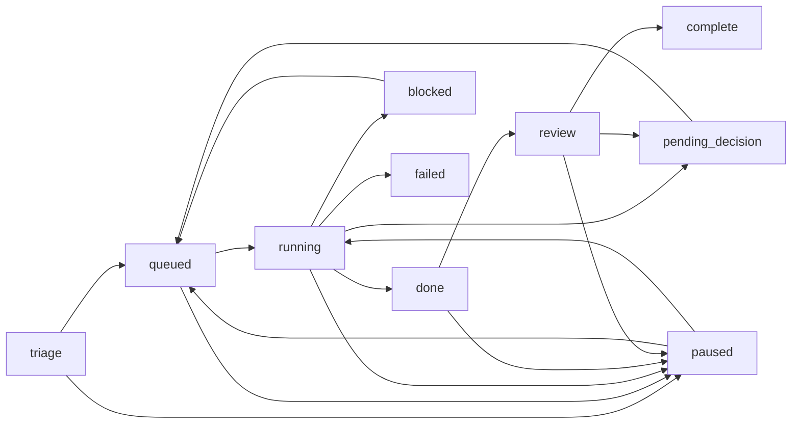
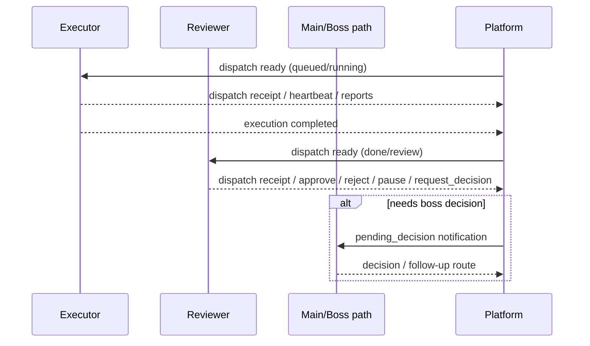
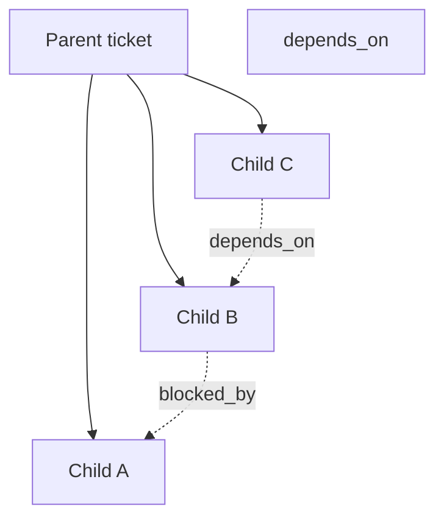

# Ticket Platform Current State

_Last updated: 2026-03-12_

## Purpose

This document is the **current-state source of truth** for the agent ticket platform.

Use it to answer:
- what is live today,
- which contracts are already implemented,
- which runtime surfaces are authoritative,
- and what a reviewer must verify before approving ticket-platform changes.

If code changes the platform behavior, this document must be updated in the same change.

## Related documents
- Gap analysis + plan: [`docs/ticket-platform-gap-analysis-and-plan.md`](./ticket-platform-gap-analysis-and-plan.md)
- Documentation maintenance policy: [`docs/ticket-platform-doc-maintenance-policy.md`](./ticket-platform-doc-maintenance-policy.md)
- Platform API overview: [`docs/API.md`](./API.md)
- Agent-facing API reference: [`docs/reference/api.md`](./reference/api.md)

---

## 1. Live architecture

### Runtime host
- Primary live platform host: **Mac**
- Canonical API base: `http://192.168.3.62:8788`
- Current topology baseline:
  - `mac-main`: `leoss / beavy / doggy / marely / auditor`
  - `pc-stock`: `cowder / donky`

### Live surfaces snapshot
| Surface | Live path | Current role |
|---|---|---|
| Runtime context | `/api/v1/agent/runtime/context` | bootstrap contract entry for agents |
| Hosted skill bundle | `/api/v1/agent/skills/current` | current hosted bundle + manifest |
| Hosted playbook bundle | `/api/v1/agent/playbooks/ticket-handler` | ticket handling playbook contract |
| Workflow schema | `/api/v1/agent/workflow/schema` | status / role / notify policy truth source |
| Dispatch queue | `/api/dispatch/ready` | executor-facing ready events |
| Notification queue | `/api/notifications/ready` | decision / result notification events |

### Core runtime surfaces
- Agent runtime context: `/api/v1/agent/runtime/context`
- Hosted skill bundle: `/api/v1/agent/skills/current`
- Hosted playbook bundle: `/api/v1/agent/playbooks/ticket-handler`
- Workflow schema: `/api/v1/agent/workflow/schema`
- Dispatch queue: `/api/dispatch/ready`
- Notification queue: `/api/notifications/ready`

### Operational components
- Gateway
- dispatch poller
- notify poller
- agent-facing API (`/api/v1/agent/*`)
- frontend views (Dashboard / Tickets / Kanban / TicketDetail)

---

## 2. Canonical status model

The platform has a live workflow schema. Status and role semantics should be read from schema first, not guessed from old docs or comments.

### Workflow overview diagram


### Core statuses in live schema
- `triage`
- `queued`
- `running`
- `paused`
- `done`
- `review`
- plus downstream terminal / exceptional states supported by the schema and runtime

### Core roles in live schema
- `triage_owner`
- `assigned_agent`
- `review_owner`
- `decision_owner`
- `paused_by`
- `next_actor_override`

### Workflow schema quick field table
| Field | Current meaning |
|---|---|
| `status` | canonical workflow state |
| `group` | state grouping for product/board semantics |
| `finality` | whether state is open / waiting / terminal style |
| `default_actor_source` | default ownership calculation basis |
| `allow_manual_override` | whether manual actor override is allowed |
| `sla` | state-specific SLA policy when present |
| `notify_policy.dispatch_ready` | whether this state should enter dispatch-ready logic |
| `notify_policy.notification_ready` | whether this state should enter notification-ready logic |
| `notify_policy.target` | the intended notification target class |

### Current contract direction
The platform is no longer in the “invent a workflow later” phase.
It already has a live workflow schema and notify policy. The remaining work is to make all other layers fully obey that schema as the single interpretation source.

---

## 3. Agent-facing contract baseline

### Runtime context
Live runtime context currently provides:
- canonical namespace info (`/api/v1/agent/*`)
- auth transport contract
- request id contract
- error model contract
- skill_ref / playbook_ref
- bootstrap endpoints
- workboard metadata

### Runtime context live checklist
When validating runtime context, reviewer should confirm at least:
- canonical namespace is `/api/v1/agent`
- preferred assignment auth transport is `X-Assignment-Token`
- error model remains `{detail, request_id}`
- `skill_ref` / `playbook_ref` versions line up with hosted bundle responses
- bootstrap endpoints still point at current live routes

### Runtime context quick field table
| Field | Why reviewer cares |
|---|---|
| `api_base_url` | confirms agent should call the right live platform base |
| `namespace.canonical_prefix` | confirms canonical route family |
| `auth.preferred_transport` | confirms assignment auth transport |
| `request_id.header` | confirms traceability contract |
| `error_model.shape` | confirms stable error format |
| `skill_ref.version` | confirms hosted bundle version in use |
| `playbook_ref.version` | confirms hosted playbook version in use |
| `bootstrap.*` | confirms bootstrap paths point to current live endpoints |

### Auth contract
- Preferred auth transport: `X-Assignment-Token`
- Legacy query/body token transport: compatibility only
- Human console bearer auth must remain separate from assignment auth

### Error model
The canonical error model is:
```json
{ "detail": "string", "request_id": "string" }
```

### Hosted playbook bundle
Hosted `ticket-handler` bundle currently defines:
- bootstrap path
- execution_mode handling
- assignment read / dependencies / comments / heartbeat / reports
- dispatch receipt handling
- single-writer constraint
- approved ticket action APIs

### Ticket action APIs
The current live platform exposes agent-facing ticket actions such as:
- create
- pause
- resume
- approve
- reject

---

## 4. Dispatch / notify runtime model

### Current live mechanism
The platform already has API-first event surfaces:
- `/api/dispatch/ready`
- `/api/notifications/ready`

### Current live observation
A healthy idle state may return:
```json
{"ready": []}
```
This is still a valid live contract result and should not be treated as missing functionality.

### Stable routing intent
- `queued / running` → dispatch to current executor
- `done / review` → notify review owner
- `pending_decision / complete / failed` → notify main / boss-facing path

### Routing sequence diagram


### Important note
This area is **not greenfield**.
The platform already has ready/ack style event surfaces.
Remaining work is about dedupe, escalation, consistency, and productization — not inventing event routing from zero.

---

## 5. Review contract current state

The review phase is already a real runtime concept.
The platform is not missing review entirely; it already supports reviewer-oriented actions and routes.

### What exists today
- `done -> review -> complete` style lifecycle support
- `review_owner`
- approve / reject / pause / resume style actions
- hosted playbook guidance that reviewers should use agent-facing action APIs rather than ad-hoc transition/comment writes

### What is still weak
- review inbox productization
- consolidated review summary presentation
- smoother reviewer decision UX
- better visibility for “needs boss decision” vs “reviewer can decide now”

---

## 6. Parent-child and dependency model current state

### Current semantics
- `parent_ticket_id` is hierarchy / container semantics
- sibling execution ordering should be represented by dependency relations, not by parent linkage alone
- dependency relations such as `depends_on / blocked_by` are part of the intended contract model

### Parent-child / dependency diagram


### Current platform expectation
Review and closeout of parent / governance tickets must consider:
- key child ticket real completion state
- stale delivery state
- hosted contract convergence
- dispatch / notify / gateway health

This is already part of the operational review standard, even where the UI and automation still lag.

### Parent closeout reviewer checklist
- Are key child tickets actually complete, not just summarized in parent text?
- Is any delivery still stale or awaiting receipt?
- Do hosted contract surfaces match the parent’s claimed conclusion?
- Are dispatch / notifications / gateway still healthy at review time?

---

## 7. Frontend current state

The platform currently includes multiple surfaces that must stay contract-aligned:
- Dashboard
- Tickets
- Kanban
- TicketDetail

Frontend changes are not accepted as complete unless:
- the promised views are actually wired in live runtime,
- not just implemented as unused components or CSS,
- and not just validated by static screenshots.

---

## 8. Known current gaps

These are the most important current-state gaps to treat as active platform debt.

### 8.1 Schema adoption is incomplete
The workflow schema exists live, but not every consumer fully treats it as the only interpretation source.

### 8.2 Event governance is incomplete
Dispatch/notify queues exist, but the surrounding dedupe, escalation, and inbox behaviors are not yet fully productized into a single clean event system.

### 8.3 Reviewer UX is under-productized
The review contract exists, but the product layer around reviewer workflows is still thin.

### 8.4 Parent closeout still depends too much on reviewer discipline
The review standard is strong, but product and automation support for parent/child closeout is still incomplete.

### 8.5 Live acceptance is still too manual
The system already exposes enough live surfaces to build a formal acceptance gate, but review still relies too much on manual cross-checking.

### Live acceptance gate MVP
The platform now exposes a minimal reviewer/read-only gate:
- `GET /api/live-acceptance/tickets/:id`

It aggregates current live surfaces into one structured verdict and is intended to reduce ad-hoc grep during review.

#### Supported verdicts
- `pass`
- `partial`
- `live-not-upgraded`
- `contract-mismatch`
- `dependency-not-closed`

#### What the gate checks in MVP
- workflow schema surface summary
- runtime context canonical prefix / auth transport / request-id / error-model contract
- hosted bundle version + checksum alignment with runtime `skill_ref` / `playbook_ref`
- latest live assignment presence for the ticket
- dependency closure (`depends_on` still open => `dependency-not-closed`)
- optional expected contract assertions supplied by reviewer via query params

#### Optional reviewer expectations
- `expected_bundle_version`
- `expected_bundle_checksum`
- `required_ticket_actions=create,pause,...`
- `required_bootstrap_endpoints=workflow_schema,runtime_context,...`
- `required_workboards=stock-tickets,...`

If `expected_bundle_version` / `expected_bundle_checksum` does not match current live hosted bundle, verdict becomes `live-not-upgraded`.
If required actions/endpoints/workboards are missing from live surfaces, verdict becomes `contract-mismatch`.

---

## 9. Reviewer gate for ticket-platform changes

For ticket-platform related work, review should not approve based on code-only evidence.

Minimum review gate:
1. code changed as intended
2. live runtime surface matches the claimed contract
3. formal docs were updated in the same change
4. docs agree with live and code

If any of the above is missing, the change is not fully complete.

### Required live surfaces by change type
| Change type | Reviewer should inspect at minimum |
|---|---|
| workflow / actor / notify semantics | workflow schema + related frontend/runtime behavior |
| agent-facing contract | runtime context + hosted bundle/playbook + `docs/reference/api.md` |
| dispatch / notify / escalation | `/api/dispatch/ready` + `/api/notifications/ready` + router logic/docs |
| reviewer actions | live action API behavior + current-state docs + UI/flow evidence |
| parent/child / dependency | live ticket/dependency behavior + current-state docs + closeout criteria |

当前 MVP 已提供 reviewer 可消费的 live gate 接口：
- `GET /api/v1/agent/assignments/:assignment_id/live-acceptance`
- verdict 至少覆盖：`pass` / `partial` / `live-not-upgraded` / `contract-mismatch` / `dependency-not-closed`
- reviewer 可结合 assignment token 与预期版本参数，直接核对 live bundle/runtime/dependency 是否达标

---

## 10. Documentation policy

This repository must keep ticket-platform documentation in sync with runtime behavior.

Required document classes:
- current-state document (this file)
- gap/roadmap document
- documentation maintenance / review policy
- API reference updates when contract changes

Rule:
> ticket-platform code changes are not complete unless formal docs are updated and live verification is recorded.
