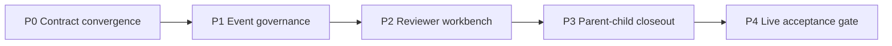

# Ticket Platform Gap Analysis and Improvement Plan

_Last updated: 2026-03-12_

This document is the **plan-B planning document** for the ticket platform.
It is intentionally structured as:
1. current live abilities that already exist,
2. gaps that remain,
3. improvement plan derived from those gaps.

The goal is to avoid over-planning from imagination. We start from live runtime truth and only propose work that clearly closes an existing gap.

## Related documents
- Current state: [`docs/ticket-platform-current-state.md`](./ticket-platform-current-state.md)
- Documentation maintenance policy: [`docs/ticket-platform-doc-maintenance-policy.md`](./ticket-platform-doc-maintenance-policy.md)
- Platform API overview: [`docs/API.md`](./API.md)
- Agent-facing API reference: [`docs/reference/api.md`](./reference/api.md)

---

## 1. Current live abilities

### 1.1 Workflow schema already exists
The platform already exposes a live workflow schema and role model. This means the platform is **past the stage of inventing workflow semantics from zero**.

### 1.2 Agent-facing runtime contract already exists
The platform already exposes runtime context, hosted skill/playbook bundles, assignment-related APIs, and agent-facing ticket actions.

Live evidence source:
- `/api/v1/agent/runtime/context`
- `/api/v1/agent/skills/current`
- `/api/v1/agent/playbooks/ticket-handler`
- `docs/reference/api.md`

### 1.3 Event queue surfaces already exist
The platform already exposes dispatch and notification ready queues.
This means the routing/event layer has a live backbone already.

Live evidence source:
- `/api/dispatch/ready`
- `/api/notifications/ready`

### 1.4 Review is already a first-class runtime stage
The system already supports reviewer-oriented actions and review-phase routing semantics.

### 1.5 Parent/child and dependency concepts already exist in operational policy
Hierarchy, dependency, parent closeout expectations, and live closeout criteria are already part of platform review practice, even where product support is incomplete.

---

## 2. Gap list

## Gap A — Workflow schema is not yet the only interpretation source

### Current state
- live workflow schema exists
- current actor / notify policy / role semantics exist

### Gap
Not every consumer layer fully relies on that schema as the only truth:
- frontend interpretation can still drift
- poller/event logic can still embed duplicated logic
- hosted bundle / runtime context / UI wording can still diverge

### Why it matters
Without full convergence, the platform keeps paying the “multiple truth sources” tax.

---

## Gap B — Event governance is present but not fully productized

### Current state
- dispatch ready queue exists
- notifications ready queue exists
- notify policy exists in schema

### Gap
Still missing a fully unified event governance layer for:
- dedupe semantics
- escalation semantics
- reviewer inbox semantics
- workflow mismatch product handling

### Why it matters
This is the area where repeated notifications, missed transitions, and routing confusion return if not fully closed.

---

## Gap C — Reviewer contract exists, reviewer product experience does not fully match it

### Current state
- review lifecycle exists
- review owner exists
- approve/reject/pause/resume style actions exist

### Gap
The reviewer path still lacks strong product support:
- review inbox
- compact review summary
- decision context view
- clean distinction between reviewer action vs boss decision requirement

### Why it matters
A system can have correct contracts but still be operationally heavy if reviewer ergonomics are weak.

---

## Gap D — Parent closeout is governed by policy more than product

### Current state
- parent/child semantics are defined at the review-policy level
- dependency correctness is part of expected acceptance

### Gap
Product/runtime support is still weaker than policy:
- parent aggregation visibility
- dependency readiness views
- parent review submission guardrails
- automated traceability checks before closeout

### Why it matters
This is a major source of “summary looks complete while children are not actually closed.”

---

## Gap E — Live acceptance still depends too much on manual reviewer effort

### Current state
The platform already exposes enough live surfaces to verify:
- workflow contract
- hosted bundle contract
- runtime context contract
- dispatch/notify readiness
- gateway/poller health

### Gap
There is still no strong, productized acceptance gate that turns these into a systematic review verdict.

### Why it matters
This is the main reason “repo updated” can still be mistaken for “live delivered.”

---

## 3. Improvement plan

## P0 — Contract convergence

### Goal
Make already-live contract surfaces fully converge into one runtime truth.

### Work items
1. make workflow schema the canonical interpretation source for every consumer
2. unify actor resolution and selectors around schema semantics
3. unify runtime context / hosted bundle / action contract wording with live behavior
4. reduce duplicated route/state interpretation in frontend and pollers

### Acceptance
- workflow/schema
- runtime context
- hosted playbook/skill bundle
- frontend rendering logic
- dispatch/notify routing logic

all describe the same behavior.

---

## P1 — Event governance productization

### Goal
Build on the existing ready/ack backbone and finish the missing event governance layer.

### Work items
1. formal dedupe key policy
2. escalation event tiers
3. workflow mismatch handling and audit surface
4. cleaner separation between dispatch events, review notifications, and boss-facing decision notifications

### Acceptance
- event routes are explainable by schema + policy
- dedupe is stage/reason/actor aware
- escalation no longer relies on scattered heuristics

---

## P2 — Reviewer workbench

### Goal
Turn the existing review contract into a real product surface.

### Work items
1. review inbox
2. review summary block
3. decision panel
4. explicit pending-decision reviewer/boss split

### Acceptance
A reviewer should be able to decide from the platform UI/API surface without reconstructing the full context manually.

---

## P3 — Parent-child closeout support

### Goal
Move parent/child correctness from reviewer discipline into product/runtime support.

### Work items
1. parent aggregation view
2. dependency readiness display
3. parent closeout guard
4. child completion / traceability checks before parent review/complete

### Acceptance
Parent tickets should not be able to look complete while critical child truth is still incomplete.

---

## P4 — Live acceptance gate

### Goal
Systematize runtime verification into a formal gate.

### Work items
1. live contract smoke checks
2. hosted bundle/version alignment checks
3. dispatch/notify/gateway health checks
4. explicit review verdict outputs such as:
   - pass
   - partial
   - live-not-upgraded
   - contract-mismatch
   - dependency-not-closed

### Acceptance
Reviewers can rely on a machine-assisted live verdict instead of ad-hoc grep and scattered manual checks.

## 4. Suggested live verification matrix

| Area | Primary live surface | Supporting doc |
|---|---|---|
| workflow semantics | `/api/v1/agent/workflow/schema` | `ticket-platform-current-state.md` |
| agent-facing contract | `/api/v1/agent/runtime/context` + hosted bundles | `docs/reference/api.md` |
| dispatch/notify behavior | `/api/dispatch/ready` + `/api/notifications/ready` | `ticket-platform-current-state.md` |
| reviewer contract | action APIs + workflow schema | `ticket-platform-current-state.md` |
| documentation policy | same-change doc diff + verification note | `ticket-platform-doc-maintenance-policy.md` |

---

---

## 4. Priority summary

### Highest-value next work
1. Contract convergence
2. Event governance productization
3. Reviewer workbench

### Medium-term
4. Parent/child closeout support
5. Live acceptance gate

---

## 5. Visual roadmap

## 6. Final recommendation

If the platform must choose one strategic direction now, it should be:

> **Finish converging existing live capabilities before inventing more platform surface area.**

The most valuable work is not “more features first,” but making the already-existing workflow, event, review, and hosted contract layers say the same thing everywhere.
